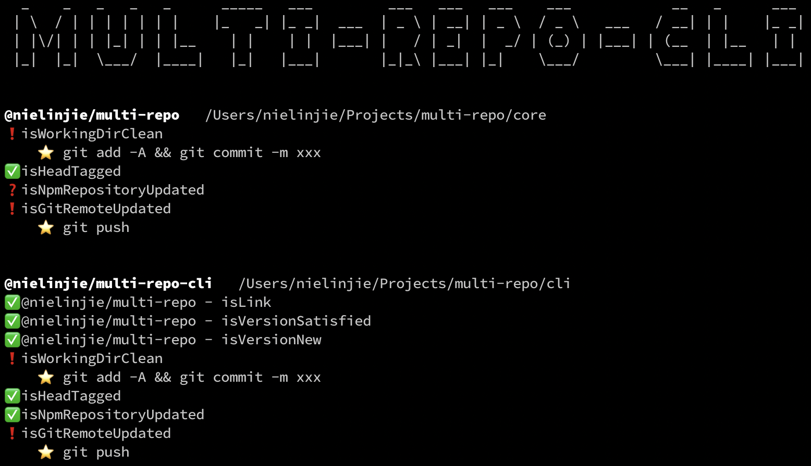

# multi-repo

帮助处理multi-repo式js项目的一个工具。

multi-repo跟mono-repo相对，也就是一个package一个项目子目录，一个package一个git repository。

（本工具暂时只针对单人，还没有考虑多人协同开发的较复杂情况。）

## 如何运行

`npx @nielinjie/mutli-repo-cli`

或者先安装 - 

`npm install -g @nielinjie/mutli-repo-cli`

（参见本工具的UI——[mutli-repo-cli](https://github.com/nielinjie/multi-repo-cli)）

## 如何工作

本人在multi-repo模式的多项目下的工作流程大致是 -

1. 需要确保对于每个项目，所依赖的package都已经最新，并上传到了npm。
2. 需要确保本package已经更新了所有依赖的版本。
3. 需要确保本package已经更新自己的版本并上传到了npm。
4. 如果需要，还需要更新本package对应的docker镜像、docker hub、github

根据上面的流程，本工具对各个项目子目录进行扫描，找到需要处置的事项并提供快速处置的协助。

0. （前提是这些项目/package/repository都在同一个父目录下。）
1. （将项目按相互依赖关系排序，以便后续操作。被依赖的放在最前面）。
2. 检查本项目working directory是否干净。
3. 检查git历史，最新提交上面是否有vx.x.x的tag。也即是否有npm version过。
4. 检查npm repository上的版本是否跟本地package 版本一致。
5. 检查Github（或者其他remote）是否更新。
6. 检查每个依赖，看其中是否有link。
7. 检查每个依赖，看是否有新的版本，新版本是否满足依赖版本范围。
8. （WIP🏃）docker相关检查。

## 参考

`multi-repo.json` 可以用来配置工作流程。将其放置在父目录即可。具体定义如下 - 

|           |          |                    |                                                              |
| --------- | -------- | ------------------ | ------------------------------------------------------------ |
| /includes | string[] | 可选，默认是['**'] | 用以匹配需要关注的package名字。以排除不需要关注的子目录。本匹配为glob风格，具体规则见“[minimatch](https://www.npmjs.com/package/minimatch)”。 |

## 感谢

1. [🌻quick-qui项目](https://github.com/quickqui/main)发起和使用本工具，效果很好。😊

